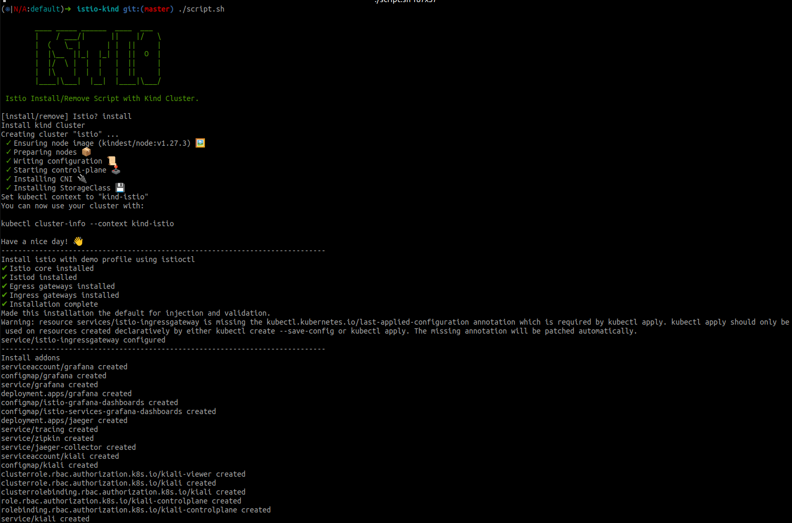
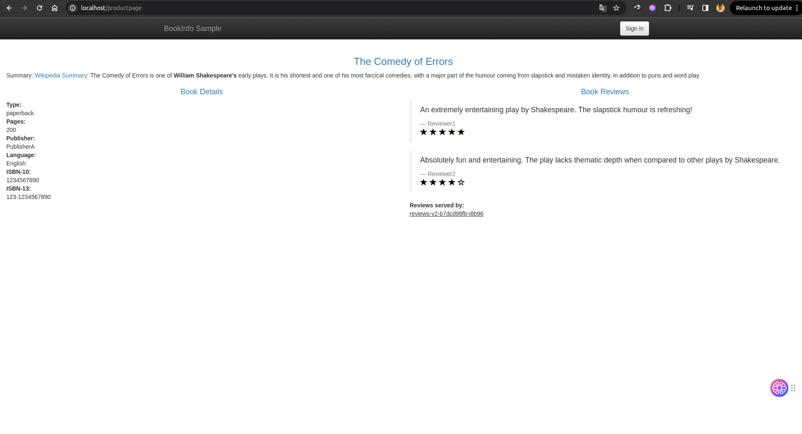
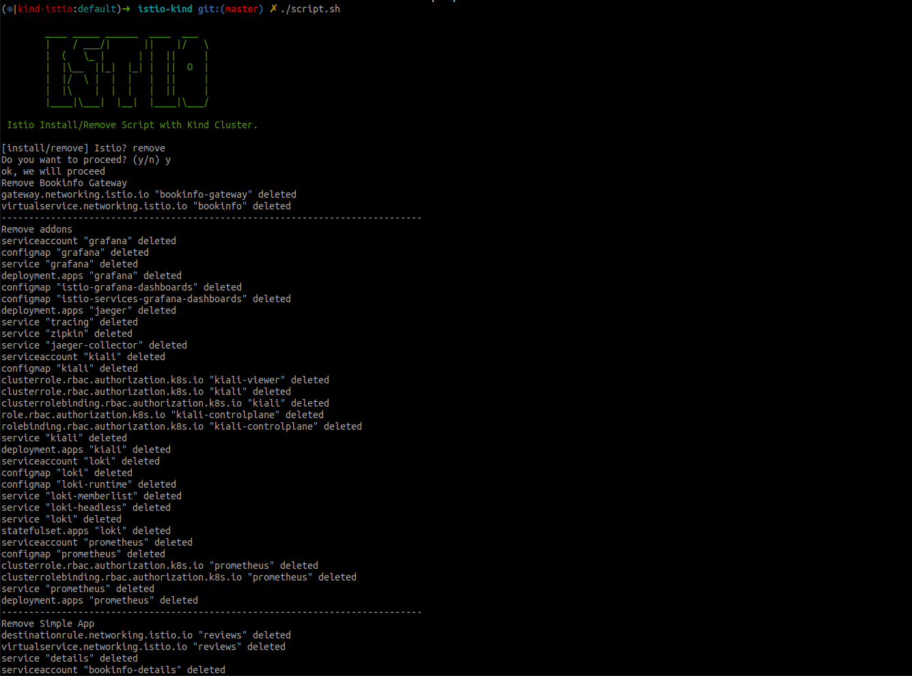

# Install Istio Service Mesh
We will install the following
- Kind to provision our kubernetes cluster
- Istio using Istioctl with demo profile
- Nginx Ingress controller
- Bookinfo simple application
- Nginx simple application

## Prerequisites

`docker`

`kubectl`

`Kind` You can find the Installation [here](https://kind.sigs.k8s.io/docs/user/quick-start/).


## Installation

**Note:** We don't need the istio-ingressgateway service to be exposed as we used ingress to forward traffic to this service.

- Just run the bellow:
    ```bash
    git clone
    ```
    ```bash
    chmod +x ./script.sh
    ```
    ```bash
    ./script.sh
    ```
    

- Please wait until the pods are in the 'Running' state, and then proceed to test the applications in your browser. Access the **Nginx app** by navigating to http://localhost/app and explore the **Bookinfo app** at http://localhost/productpage.

     
## Uninstall
- To remove all the setup run the following
    ```bash
    ./script.sh
    ```
    
 
